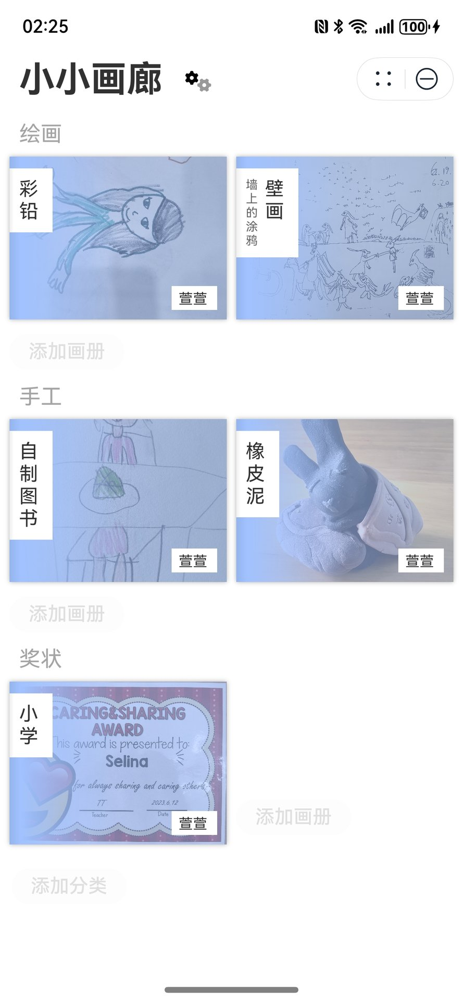
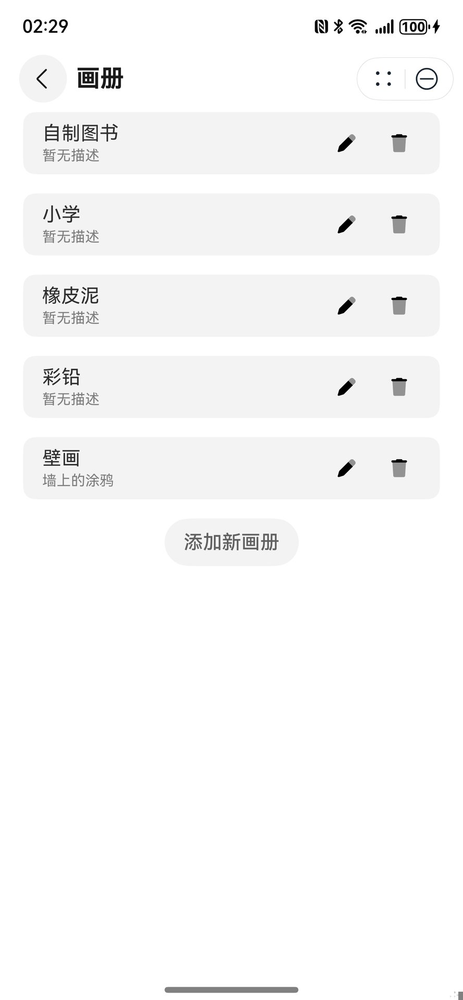
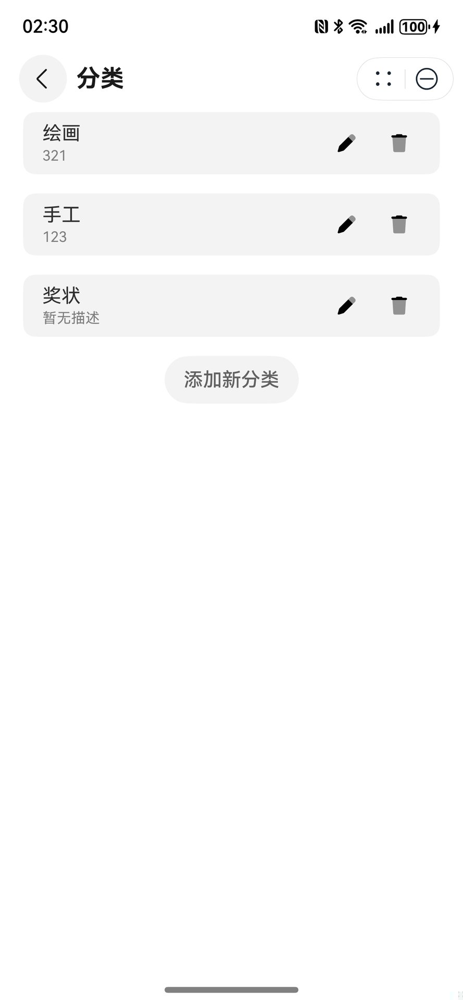
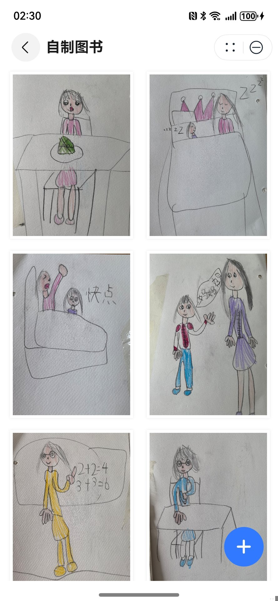
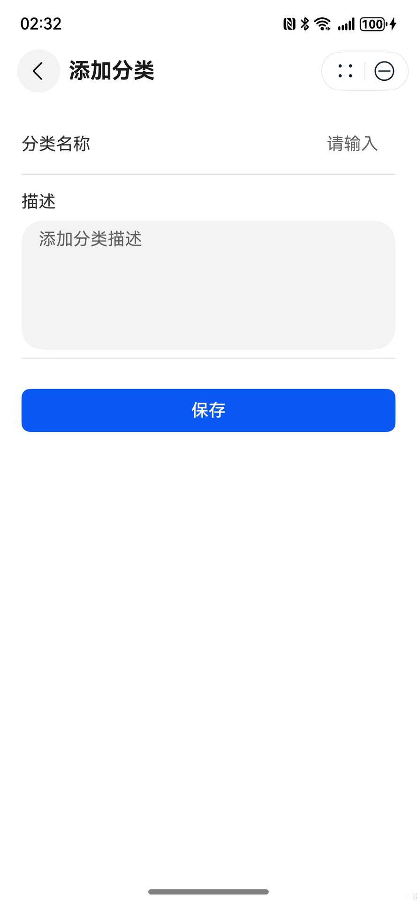
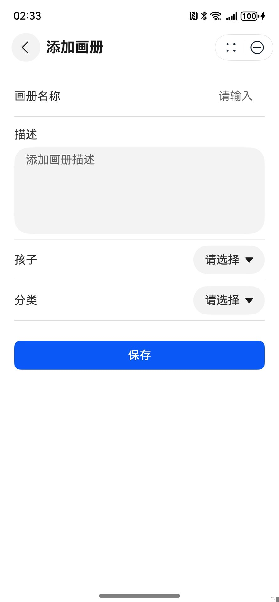
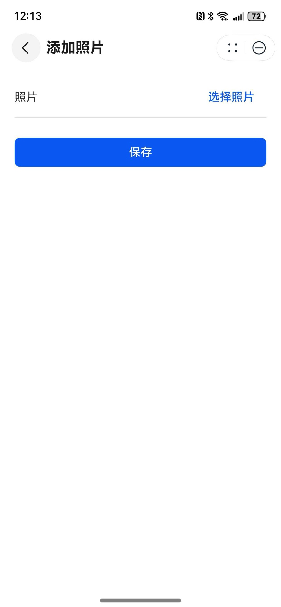
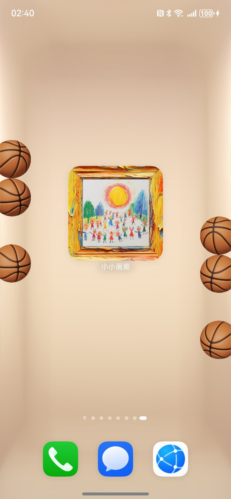

# 小小画廊 Little Gallery

小小画廊 是一个基于 HarmonyOS/ArkTS 开发的儿童画册应用。它允许家长为孩子创建个性化的画册，记录孩子的艺术创作和成长历程。


>  **#端云一体化开发# 《小小画廊》创意方案分享**
> https://developer.huawei.com/consumer/cn/forum/topic/0201168792253680832
>
> **#端云一体化开发# 《小小画廊》技术方案分享**
> https://developer.huawei.com/consumer/cn/forum/topic/0208168783942934914


## 效果预览

| **首页** | **画册列表** | 分类列表 | 孩子列表 |
|----------|------------|------------|------------|
|  |  |  |  |
| **相册** | **照片** | **添加孩子** | **添加分类** |
|  |  |  |  |
| **添加画册** | **添加照片** |  **服务卡片** |  |
|  |  |    |  |


## 功能特点

- 📱 支持多个孩子的作品管理
- 📂 灵活的画册分类系统
- 🖼️ 瀑布流式照片展示
- 🔍 图片详情查看与缩放
- 👤 华为账号登录集成
- ☁️ AGC 云服务集成
- 📊 默认数据生成

## 技术栈

- HarmonyOS/ArkTS
- AGC (AppGallery Connect) 服务
  - 云存储
  - 云数据库
  - 认证服务
- @ohos/photoview 组件

## 项目结构

```
Application/entry/src/main/ets/
├── common/                 # 公共组件和工具
│   ├── MainStat.ets       # 主状态管理
│   └── WaterFlowDataSource.ets  # 瀑布流
├── components/            # UI组件
│   ├── AgreementDialog.ets    # 协议对话框
│   ├── AlbumItem.ets         # 画册项组件
│   ├── PictureItem.ets       # 图片项组件
│   └── SettingDialog.ets     # 设置对话框
├── entryability/         # 应用入口
├── entryformability/     # 卡片入口
├── frame/pages
│   └── FrameCard.ets  # 服务卡片
├── module/               # 数据模型
│   ├── Album.ts         # 画册模型
│   ├── Category.ts      # 分类模型
│   ├── Child.ts         # 孩子信息模型
│   └── Picture.ts       # 图片模型
├── pages/               # 页面
│   ├── Index.ets        # 主页
│   ├── AddAlbum.ets     # 添加画册
│   ├── AddCategory.ets  # 添加分类
│   ├── AddChild.ets     # 添加孩子
│   ├── AddPicture.ets   # 添加图片
│   ├── AlbumDetail.ets  # 画册详情
│   └── PictureDetail.ets # 图片详情
├── services/            # 业务服务层
│   └── CoreService.ts   # 核心业务服务
└── utils/              # 工具类
    ├── AppConfig.ts    # 应用配置
    └── WindowUtils.ts  # 窗口工具类
```

### 云函数项目结构

```
CloudProgram/
├── clouddb/               # 云数据库配置
│   ├── db-config.json    # 数据库基础配置
│   └── objecttype/       # 数据模型定义
│       ├── Album.json    # 画册模型
│       ├── Category.json # 分类模型
│       ├── Child.json    # 孩子信息模型
│       └── Picture.json  # 图片模型
├── cloudfunctions/       # 云函数
│   ├── id-generator/     # ID生成器云函数
│   └── preload/          # 预加载云函数
├── cloud-config.json     # 云服务配置
└── package.json          # 项目依赖配置
```


## 技术特性

### 状态管理 (V2)

本项目采用 HarmonyOS 最新推荐的状态管理方案 - [状态管理（V2）](https://developer.huawei.com/consumer/cn/doc/harmonyos-guides-V5/arkts-new-componentv2-V5)。

### 导航与切换

本项目采用 HarmonyOS 官方推荐的导航方案，使用 NavPathStack 组件配合 navDestination 属性实现页面路由。这种方案提供了以下优势：

- 声明式导航：通过 navDestination 属性直接声明导航目标
- 页面栈管理：自动维护页面导航历史
- 类型安全：支持 TypeScript 类型检查
- 动画过渡：内置丰富的页面切换动画


### 预加载机制

本项目集成了 AGC 云函数的预加载机制，用于优化应用启动性能。通过在 EntryAbility 中实现预加载逻辑，可以在应用启动时快速获取配置数据。

主要实现:
1. 预加载模式获取配置
2. 普通模式作为降级方案

预加载机制的优势:
- 更快的启动速度：应用启动时直接使用预加载的缓存数据
- 更好的用户体验：减少首次加载等待时间
- 降级保护：预加载失败时自动切换到普通模式

> 预加载功能基于 [AGC 云函数预加载](https://developer.huawei.com/consumer/cn/doc/AppGallery-connect-Guides/agc-preload-introduction-0000001881320189)实现。

### APMS 崩溃分析

本项目集成了 AGC (AppGallery Connect) 的 APMS (Application Performance Management Service) 服务，用于监控和分析应用崩溃问题。

集成 APMS 的优势:
- 实时监控：第一时间发现应用异常
- 详细分析：提供完整的崩溃堆栈信息
- 快速定位：准确定位问题代码位置
- 统计报表：提供崩溃率等统计数据

> APMS 功能基于 [AGC 崩溃分析服务](https://developer.huawei.com/consumer/cn/doc/AppGallery-connect-Guides/agc-crash-arkts-analyse-0000001811026341)实现。

### 端云一体化架构

本项目采用 HarmonyOS 端云一体化开发架构，通过 AGC (AppGallery Connect) 云服务实现数据存储、用户认证等核心功能。

- 云存储: 存储图片等媒体文件
- 云数据库: 存储用户数据、画册信息
- 认证服务: 华为账号登录
- 云函数: 处理业务逻辑
  

端云一体化优势:
- 快速开发: 云服务组件化集成
- 弹性扩展: 按需使用云资源
- 数据安全: 端到端加密传输
- 成本优化: 按量付费模式

> 端云一体化架构基于 [HarmonyOS 云开发](https://developer.huawei.com/consumer/cn/doc/harmonyos-guides-V5/agc-harmonyos-clouddev-overview-V5)实现。

### 数据库设计

本项目使用 AGC CloudDB 作为数据存储方案，采用面向对象的数据模型设计。主要包含以下几个核心对象：

#### Child (孩子信息)
- 基本信息：姓名、生日、性别
- 支持排序：通过 sort 字段控制显示顺序
- 索引设计：按名称和排序字段建立索引

#### Category (画册分类)
- 基本属性：名称、描述
- 时间管理：记录创建时间
- 排序支持：支持自定义排序
- 索引优化：按创建时间和排序字段建立索引

#### Album (画册)
- 关联设计：与 Child 和 Category 建立关联
- 基础信息：名称、描述
- 时间追踪：记录创建时间
- 多重索引：支持按时间、分类、孩子和排序查询

#### Picture (图片)
- 丰富属性：图片URL、描述、标签
- 多重关联：关联到 Album、Category 和 Child
- 时间记录：创建时间
- 完整索引：支持多维度查询需求

#### 权限设计
所有对象采用统一的四层权限控制：
- World：允许读取
- Authenticated：允许读取
- Creator：完整读写权限
- Administrator：完整管理权限

#### 数据安全
- 主键策略：所有对象使用 String 类型 id 作为主键
- 用户隔离：通过 userId 字段实现数据隔离
- 默认值：关键字段设置合理默认值
- 必填控制：核心字段设置 notNull 约束

